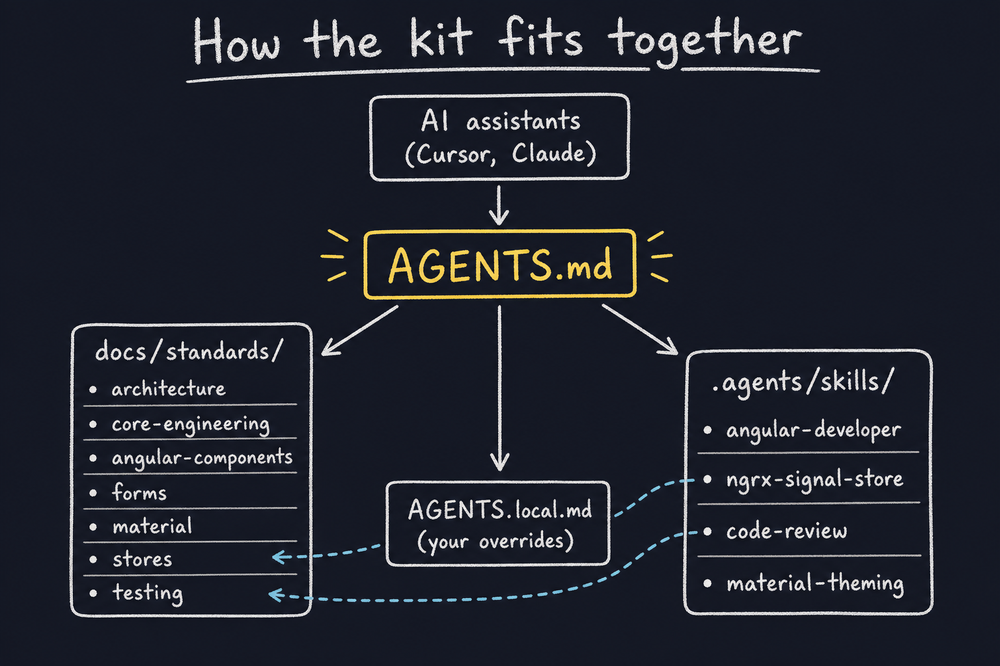
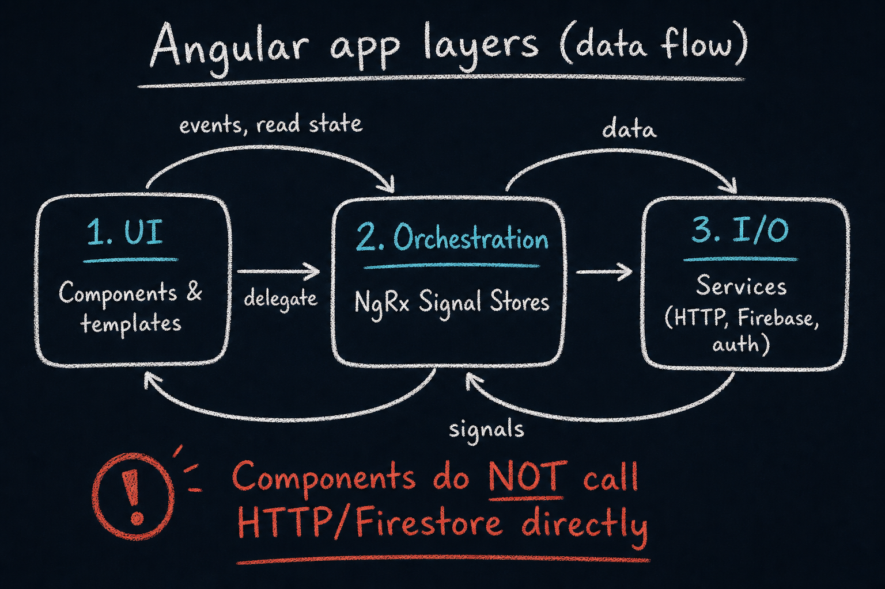
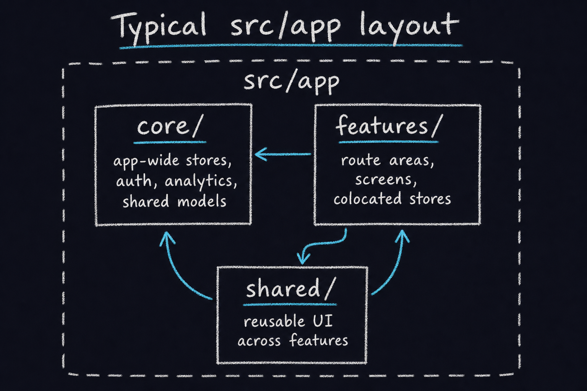

# agent-workflow-kit

**Agent workflow for Angular teams** — install shared coding standards and Cursor/Claude skills into any Angular project so humans and AI assistants follow the same conventions.

The kit does not change your app at runtime. It copies three things into your repo:


| What                      | Where             | Role                                                                           |
| ------------------------- | ----------------- | ------------------------------------------------------------------------------ |
| **Agent entrypoint**      | `AGENTS.md`       | Tells assistants where rules and skills live                                   |
| **Engineering standards** | `docs/standards/` | How *this* stack should be built (layers, components, stores, tests, …)        |
| **Task skills**           | `.agents/skills/` | Step-by-step workflows for specific jobs (code review, new stores, theming, …) |


Your team keeps **`AGENTS.local.md`** at the project root for repo-specific overrides (versions, internal docs, exceptions). The kit never overwrites that file.

---

## Who this is for

If you use **Cursor**, **Claude Code**, or similar agents on Angular work, you have probably seen inconsistent suggestions: mixed patterns for signals vs RxJS, components calling HTTP directly, or Material overrides that break on upgrade.

This kit gives agents (and new teammates) one place to look:

- **Standards** = what we enforce in this codebase  
- **Skills** = how to execute common tasks correctly  
- **`AGENTS.local.md`** = what is different in *your* repo

---

## Quick start

**Requirements:** Node.js 18+

From GitHub:

```bash
npx github:thisiszoaib/agent-workflow-kit init
```

After install, open **`AGENTS.md`** in your editor or mention it in agent chats. Add **`AGENTS.local.md`** when you need project-specific rules.

---

## How the pieces fit together



**Rule of thumb:** Standards define *your* rules. The **angular-developer** skill adds broad Angular guidance on top. The **code-review** skill runs audits against the standards—it is not duplicated inside `docs/standards/`.

---

## Application architecture (from standards)

The standards describe a **layered** Angular app: UI stays thin, stores orchestrate feature flows, services own I/O.



**Data-flow rule:** For feature work, components should **not** call analytics, Firestore, or arbitrary HTTP directly—they go through a **store method** that delegates to services.

### Typical `src/app` layout



| Folder      | Purpose                                                                |
| ----------- | ---------------------------------------------------------------------- |
| `core/`     | Singletons used app-wide (e.g. root `signalStore`, auth, analytics)    |
| `features/` | Lazy-loaded route areas; colocate stores and types with the feature    |
| `shared/`   | Cross-feature UI (e.g. auth dialog + local store, thin sub-components) |


**Local vs app-wide stores:** Dialog-only or screen-only state lives in a **component-scoped** `signalStore`. State read by multiple features belongs in a **root** store (`providedIn: 'root'`). Details: [docs/standards/state-and-stores.md](docs/standards/state-and-stores.md) and [docs/standards/architecture.md](docs/standards/architecture.md).

---

## Skills (what each package gives you)

Skills live under `.agents/skills/`. Agents load them when a task matches the skill description (or when you ask explicitly, e.g. “run a code review”).


| Skill                                                                    | When it helps                                                         | In plain terms                                                                                                                                                                                       |
| ------------------------------------------------------------------------ | --------------------------------------------------------------------- | ---------------------------------------------------------------------------------------------------------------------------------------------------------------------------------------------------- |
| **[angular-developer](.agents/skills/angular-developer/)**               | Building or refactoring Angular code (credits: Angular official team) | Broad, version-aware Angular guidance: components, signals, forms, routing, DI, testing, CLI. Use with `references/` for deep topics. **Your repo’s stricter rules still live in `docs/standards`.** |
| **[ngrx-signal-store](.agents/skills/ngrx-signal-store/)**               | Creating or changing `signalStore`                                    | Recipes for `withState`, `withComputed`, `withMethods`, `withHooks`, and `rxMethod`—including inject style and async flows. Aligns with [state-and-stores.md](docs/standards/state-and-stores.md).   |
| **[code-review](.agents/skills/code-review/)**                           | “Review my PR”, convention audits                                     | Scopes the diff, routes files to the right standards, runs a full checklist, and reports deviations with citations—not a separate standards doc.                                                     |
| **[angular-material-theming](.agents/skills/angular-material-theming/)** | Material 3 theming and overrides                                      | Safe theming with `mat.theme()` and `mat.<component>-overrides()` using real tokens from [material.angular.dev](https://material.angular.dev)—avoids brittle `.mat-mdc-`* hacks.                     |
| **[angular-new-app](.agents/skills/angular-new-app/)**                   | `ng new` / greenfield setup (credits: Angular official team)          | CLI-first steps for new apps, including `--ai-config` so generated projects match modern agent workflows.                                                                                            |


---

## Standards (what each doc covers)

All standards are in [docs/standards/](docs/standards/). `AGENTS.md` links the full index; summary:


| Standard                                                                    | You will find                                                                        |
| --------------------------------------------------------------------------- | ------------------------------------------------------------------------------------ |
| [architecture.md](docs/standards/architecture.md)                           | Layers (UI → store → service), `core/` / `features/` / `shared/`, canonical examples |
| [core-engineering.md](docs/standards/core-engineering.md)                   | TypeScript strictness, accessibility (WCAG AA, AXE)                                  |
| [angular-components.md](docs/standards/angular-components.md)               | Standalone components, OnPush, control flow, inputs/outputs                          |
| [forms.md](docs/standards/forms.md)                                         | Signal Forms and project form conventions                                            |
| [templates-and-styling.md](docs/standards/templates-and-styling.md)         | Tailwind, splitting large templates, button layout                                   |
| [material.md](docs/standards/material.md)                                   | Material usage and theming expectations in this repo                                 |
| [state-and-stores.md](docs/standards/state-and-stores.md)                   | Signals in components, Signal Store patterns, app vs local stores, `rxMethod`        |
| [services-and-side-effects.md](docs/standards/services-and-side-effects.md) | What belongs in services vs stores vs components                                     |
| [testing.md](docs/standards/testing.md)                                     | Unit tests, harnesses, E2E (e.g. Playwright)                                         |


---

## License

MIT — see repository license file.